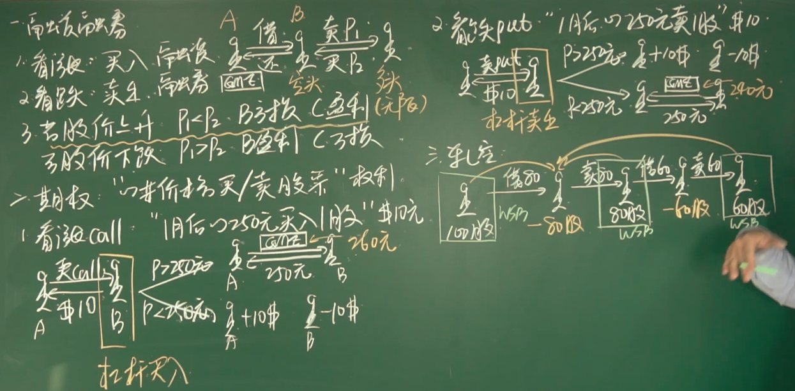

# 股票知识基础

> 最近有一个新闻刷爆了互联网，说是美国有一家线下的游戏销售公司名字叫做[#游戏驿站GME](https://www.youtube.com/hashtag/游戏驿站gme) 。因为疫情和在线游戏的双重冲击，它的业绩一直都不太理想。但是从今年年初开始，它的股价就好像坐了火箭一样蹭蹭的往上蹿，从1月初的不到20美元一股，到最高点接近于500美元一股，股价上涨了20多倍。那么如果从去年最低点3美元一股开始算，股价上涨了100多倍。这件事被媒体形容为美国[#散户](https://www.youtube.com/hashtag/散户) 血洗华尔街大佬。有小朋友就问我说：为什么这个公司的[#股票](https://www.youtube.com/hashtag/股票) ，可以在这么短的时间内上涨这么多倍呢？这个美国散户是如何血洗华尔街大佬的呢？今天我们就来讨论一下这个问题

##  融资融券

1. 看涨：买入称为融资，投资者为多头

从其他投资者处买入股票等待股市上涨后将股票出售赚取差价

2. 看跌：卖出称为融券，投资者为空头

从其他投资者A借股票后将其再卖出，等待股市下跌后再从市场中买入股票还给最初的借入者A以此来赚取差价，在这个过程中A将股票借出也会获得利息

3. 当股价上升的时候，空头会赔钱，股价下跌的时候，空头会赚钱；实际上股票可以无限上涨但下跌会有限制，所以做空是一种很专业的行为，一般大的做空机构都会针对一些行业出具调查报告(财务作假)使得相应股票下跌

## 期权

期权是一种权利，在未来可以以某一个价格买入/卖出股票

1. 看涨期权(call)

举例：假设A有“一个月后以250元买入一股” 该期权售价10元，B花费10元钱买了A的期权，当一个月后股票价格大于250，B会行权，B给A 250 元购买一股，此时 B 的实际花费相当于260元(10元期权+250买入价)；当一个月后股票价格小于250，B 不行权，此时 B 损失10元。

在这个过程中由于A可能被行权，所以一般需要提前购买股票存储来对冲风险，否则等到股票上升后再购买兑现B的期权会损失更大。

B的行为成为杠杆买入，购买期权可以增加杠杆，使得用更少的钱购买更多的股票。

2. 看跌期权(put)

举例：假设 A 有“一个月后以250元卖出一股” 该期权售价10元，B花费10元钱买了A的期权，当一个月后股票价格大于250，B不会行权，此时B损失10元；当一个月后股票价格小于250，B 会将股票以期权约定价格250元卖出，此时 A 的实际花费为240元(-10期权+250行权买股)。

B的行为成为杠杆卖出(融券卖出)，同样该过程也加入杠杆。

## 轧空

散户血洗华尔街的行为

由于做空机构并不看好GME的股票，所以融券买入后卖出，这个过程可能会被重复导致做空股票的比例越来越大甚至超过流通股，此时由于WSB版友联合起来不出售股票，做空机构没有股票平仓，导致股价上涨；而且版友还购买call，此时做空机构需要提前购买股票存储(如果等股价升高后购买会亏损更大)来对冲风险，结果WSB版友没有人卖股票进一步导致股价上升。

如果市场对一个股票极度不看好，很多做空机构建立空仓，那么空军的动能就会消耗殆尽，接下来股票一定会上涨，反之大多数人看好一只股票，多军大量涌入，那么接下来该股票就会下跌

