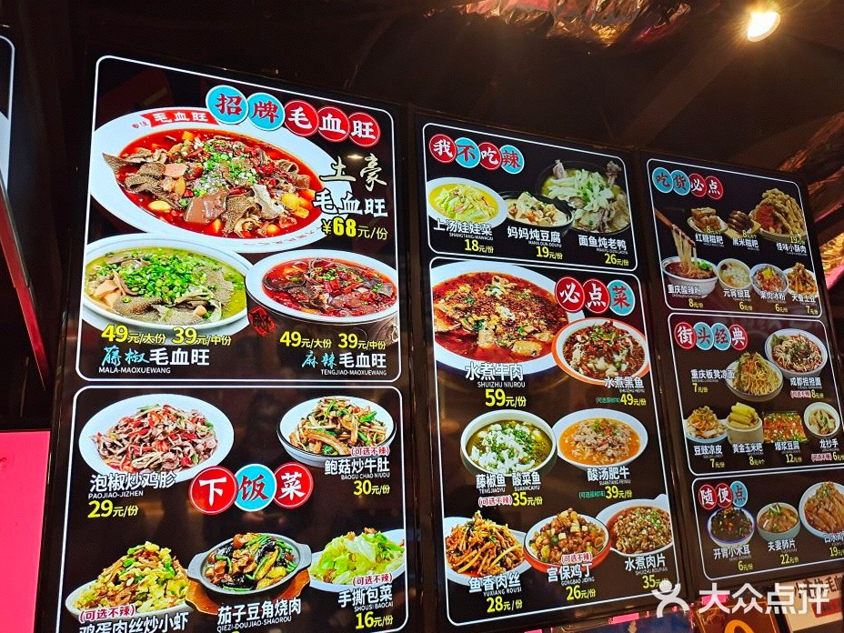
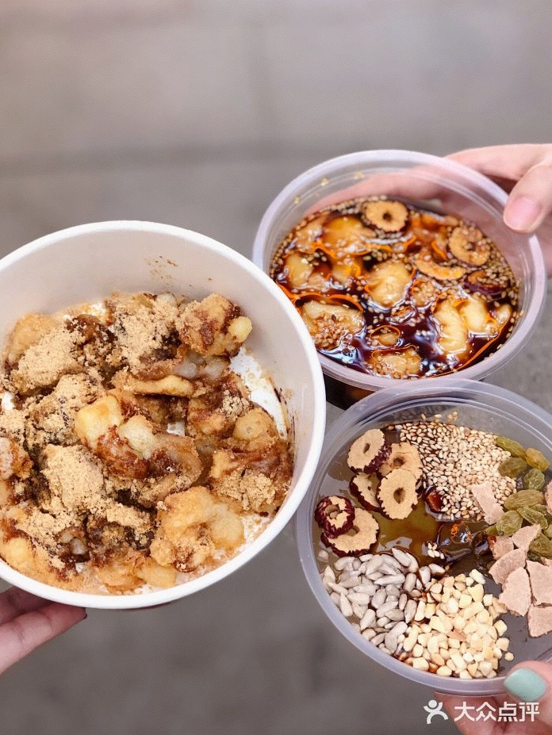
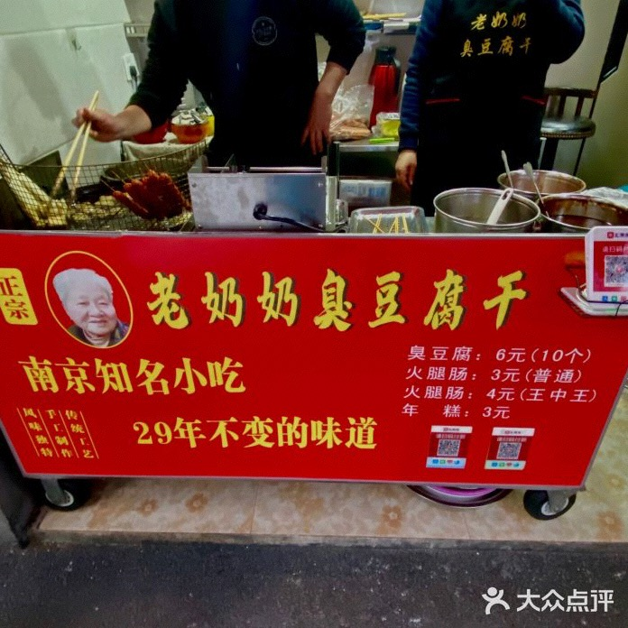

# 南京

本文主要用于盘点俺逛过的南京景区以及吃过的南京美食。

## 景区

## 美食

美味打分是越高越好，价格打分越高就是越便宜，性价比就是越高越好

### 主食

1.小渝快毛血旺

地点：大洋百货地下一楼

美味：☆☆☆☆ 味道很好

价格：☆☆☆人均大约40左右吧

性价比：☆☆☆☆性价比很高

推荐菜(吃过觉得比较好)：土豪毛血旺、上汤娃娃菜、口水鸡

备注：位置很挤，座位不是那种分散开的，小桌子，空间很小，多人吃可能会比较逼仄。两个人的话应该不错。

### 小吃

小吃街：羊皮巷、明瓦廊、丰富路（吃的多）

1.食兮红糖滋粑

地点：秦淮区丰富卢142号，这个地方就是小吃一条街，很建议去逛逛

美味：☆☆☆☆☆ 味道很好

价格：☆☆ 人均大约10左右吧

性价比：☆☆☆☆☆性价比很高

备注：可以美团买可能会更便宜

2.老奶奶臭豆腐干

位置：店在东南大学对面的胡同里

美味：☆☆☆ 味道不错

价格：☆☆ 人均大约10左右吧

性价比：☆☆☆☆☆性价比很高

备注：两个人的话臭豆腐买一份就好虽然一点都不臭，酱汁不错。下次可以尝尝年糕。

