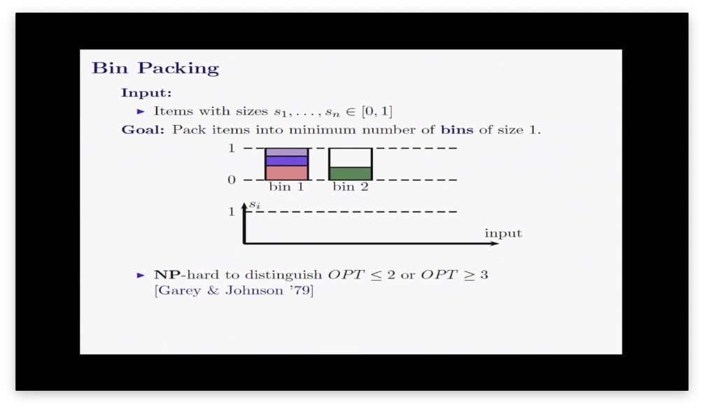
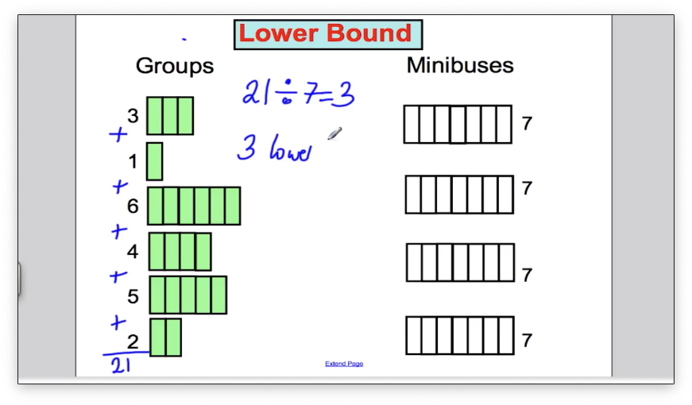

# Bin packing

装箱问题描述的是将不同大小的物品装进集装箱中，要求使用的集装箱数量最少，该问题是NP难问题

## 下限 lower bound

 

将所有物品相加后除以每个箱子的容量得到的箱子数量就是需要箱子的下限

## First-fit算法

按照物品的初始顺序依次对物品进行选择合适的箱子，当箱子容量不够的时候就使用新的箱子

## First-fit descreasing算法

首先对物品进行降序排序，然后按照First-fit的方式进行装箱

## Full-bin packing 算法

首先将物品组合成箱子的容量，然后将组合后的物品装箱

FF使用起来简单，但是往往不能得到最优解，FFD相比于FF得到的结果更好，FBP在多数情况下会得到比较好的解但是却需要大量计算

## Best-fit 算法

类似与fist-fit的方式，按照初始顺序将物品以此匹配到箱子，不同的时每一次都和能够使得匹配后余量最小的箱子进行配对

## Approximation algorithm

给定问题时优化问题但是问题本身是NP难的，能够将原问题进行简化为一个多项式时间的问题