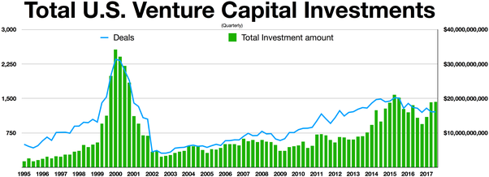

以下所有片段选自quora中回答：



## Do Dutch people always go Dutch?(荷兰人都是AA制么？)

I want to start by stating that in the Netherlands, no one ever uses this reference. Also, I am in awe about how negative people are about the go dutch concept. So I’m going to try to break it down so every one can see and hopefully value the logic.

In the Netherlands, fairness and justice is central when it comes to the financial aspect. And most people are really protective of their money. This however does not necessarily mean that the Dutch has a stingy culture as they are so infamously known for. As protective as they are about their own money, they’re as protective about other’s money.

**stingy:** ungenerous, notwilling to spend money 

------

Dutch people take pride in their independence, paying one’s bill without approval is a gigantic step on one’s ego and it will throw said person off, cultivating an awkward atmosphere.

**gigantic:** huge,big,enormous

**step on one’s ego:** to insult somebody’s self-esteem

------

When acquaintances go out, it is uncommon that one pays for all, unless clearly agreed upon before leaving in the first place. And even then when someone says no, please don’t insist on paying. You won’t make friends this way.

**acquaintance:** someone you slight know but not that familar with

------

When friends go out, bills are always split. This however depends on the depths of the friendship, how often you see each other and the financial situation of each person. The only time one’s bills get paid for without any verbal agreement, is on special occasions. (Birthdays,graduations etc)

In short, if you don’t know someone well enough to make an accurate estimation of their financial situation, don’t expect them to pay for you. But also, don’t pay for them. As one will see this as an insult.

**split the bill:** go dutch, every pay for their own part

**verbal:** somebody say something

## [Why do we hear so much about China dominating AI, when (as of 2019) most of the leading AI researchers and research centers are in the US, UK, or Canada?](https://www.quora.com/Why-do-we-hear-so-much-about-China-dominating-AI-when-as-of-2019-most-of-the-leading-AI-researchers-and-research-centers-are-in-the-US-UK-or-Canada)

Take a step back for a second and think about anything that has revolutionized the world.

Take the internet for example. Did the masses understand what the **advent** of the internet would look like? *Absolutely not*. I would argue that the advent of the thing has no relationship with many people *anticipating* it to arrive. Nobody was **biting their lips** waiting for something like the internet to happen. The internet happened, and now, decades later, it has completely changed the way we live.

**advent:** incoming of something

**bite one’s lip:** stay silent

By the late 1990s, everybody wanted to put stuff on the internet. People thought it would revolutionize the world. People were getting behind all these ideas, and venture capital money was easily flowing into building the infrastructure of the internet.

It later turned out that this was just another form of railway **mania**, where many people *thought* it would change everything, but it ended up being a much harder problem than we initially thought. As a consequence, many of the people, insiders and initial investors excluded, lost a lot of money.

**mania:** love in an irrational way

20 years later, everybody is getting behind AI without fully understanding what the hell they’re talking about. One of the biggest areas AI is turning a key profit is in areas like digital advertising, where companies such as Amazon, Google, and Facebook are selling digital real estate in exchange for your eyeballs and taps/clicks.

If the future of artificial intelligence is making money off of webpage real estate via advertising, I’m not sure how any country could be happy about the “domination of AI”.

**estate:** propert