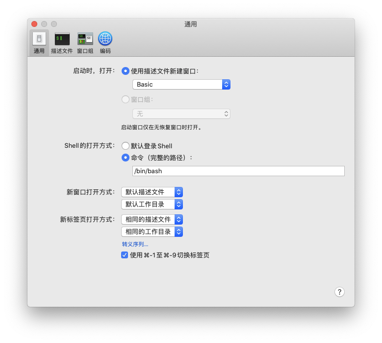

# 终端使用

## 1.什么是zsh、bash?为什么老是出现zsh: command not found？

### 1.1什么是shell？

- shell：在操作系统中有一个内核的概念，内核控制着整台电脑的硬件，负责程序与硬件之间的交互工作。但是由于内核处于系统的底层不能让用户随意操作，所以就有了shell，用户通过访问操作系统中的shell实现对于内核的访问。


shell又分为命令行shell和图形化shell，在mac系统中Finder就是一个图形化shell：


相应的终端就是一个命令行shell：


- 不同的shell实现：命令行shell存在多种，可以通过`cat /etc/shells`命令查看系统中存在哪些shell：


通过上面的图也可以看到zsh、bash、csh等都是shell。

> **不同shell的区别**：
>
> zsh
> 很多人的 mac 中会使用 zsh 而不是 bash，一大半是因为 oh-my-zsh 这个配置集，它兼容 bash，还有自动补全等好用的功能。
>
> sh 的全称是 Bourne shell，由 AT&T 公司的 Steve Bourne开发，为了纪念他，就用他的名字命名了。sh 是 UNIX 上的标准 shell，很多 UNIX 版本都配有 sh。sh 是第一个流行的 shell。
>
> csh
> sh 之后另一个广为流传的 shell 是由柏克莱大学的 Bill Joy 设计的，这个 shell 的语法有点类似C语言，所以才得名为 C shell ，简称为 csh。
>
> tcsh
> tcsh 是 csh 的增强版，加入了命令补全功能，提供了更加强大的语法支持。
> ash一个简单的轻量级的 Shell，占用资源少，适合运行于低内存环境，但是与下面讲到的 bash shell 完全兼容。
>
> bash
> bash由 GNU 组织开发，保持了对 sh shell 的兼容性，是各种 Linux 发行版默认配置的 shell。bash 兼容 sh 意味着，针对 sh 编写的 shell 代码可以不加修改地在 bash 中运行。尽管如此，bash 和 sh 还是有一些不同之处：一方面，bash 扩展了一些命令和参数；另一方面，bash 并不完全和 sh 兼容，它们有些行为并不一致，但在大多数企业运维的情况下区别不大，特殊场景可以使用 bash 代替 sh。

### 1.2 为什么使用zsh时候总是出现command not found

这是因为之前使用的很多命令在.bash_profile中设置了[环境变量](https://zhuanlan.zhihu.com/p/57229931)，而切换到zsh后.zshrc中并没有相应的环境变量，简单来说就是之前的环境变量全都设置在另一个shell中新的shell中没有这些变量所以出现找不到命令的错误。这个时候解决方案有两种，一是将.bash_profile中设置的环境变量加入到.zshrc中，二是直接切换使用bash作为shell即可。

- 方法一：.zshrc中配置环境变量

```sh
open .zshrc
```

使用命令打开配置文件，然后在下面加入一行配置：

```sh
source ~/.bash_profile
```


加入完成后在zsh终端中执行：

```sh
source .zshrc
```

然后就可以愉快使用zsh了。

- 方法二：切换shell

可以在终端的偏好设置通用中对不同的shell进行设置，就是下图中shell的打开方式，将其切换为bash就行。



如果不知道其他shell的路径，可以在zsh中输入`cat /etc/shells`命令查看不同shell的位置：


参考文章：

[1] [终于制服了它们:什么是 Shell？什么是终端？什么是命令行？](https://mp.weixin.qq.com/s/J9fN-ND4Do9cEpL5lqdarA)

[2] [shell有哪些？Zsh和Bash的区别是什么？](https://www.jianshu.com/p/a891af6f87e0)

[3] [关于环境变量，我想给初学者说](https://zhuanlan.zhihu.com/p/57229931)

[4] [mac中bash转zsh后部分全局命令不可用的解决办法](https://blog.csdn.net/weixin_45419138/article/details/105004384)

## ``zsh: permission denied:``

使用终端执行sh文件时出现``zsh: permission denied:``问题原因是对于``.sh``文件读取没有权限，使用下面命令增加权限：

```shell
chmod u+x <脚本文件>
`chmod是权限管理命令change the permissions mode of a file的缩写。
`u代表所有者。x代表执行权限。’+’ 表示增加权限。
`chmod u+x file.sh 就表示对当前目录下的file.sh文件的所有者增加可执行权限。
```


sd

